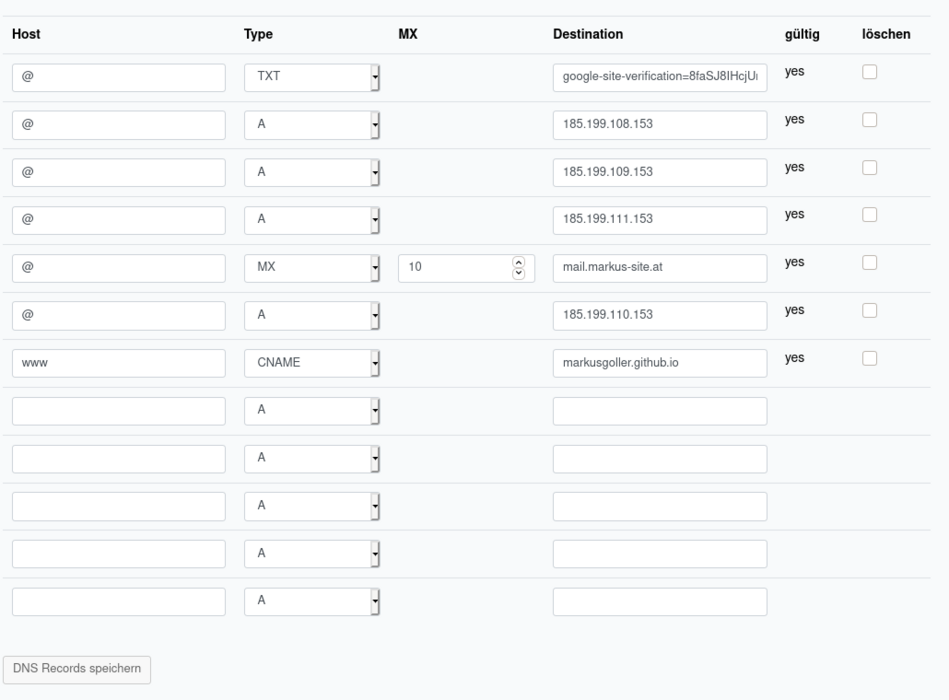

# Making of markus-site.at
Here I want to describe how my [personal blog](https://markus-site.at) was created. Please have also a look at the corresponding [GitHub](https://github.com/markusgoller/markus-site/) repo.

See also:
https://www.cameronmacleod.com/blog/github-pages-dns
https://docs.github.com/en/free-pro-team@latest/github/working-with-github-pages/managing-a-custom-domain-for-your-github-pages-site#about-custom-domain-configuration


I build the blog with the help of the static site generator [Pelican](https://docs.getpelican.com/en/stable/) which is written in [Python](https://www.python.org/).
To publish the site I used [GitHub](https://github.com/) and [GitHub Pages](https://pages.github.com/).
The order is mostly the same as the GitHub commits, but not always. Have fun creating your own blog, I hope my notes will help you!

Many greetings Markus

## Buy a domain:
I used [netcup](https://www.netcup.de/), but you can also use [GoDaddy](https://at.godaddy.com/domains) or [namecheap](https://www.namecheap.com/) etc. .

On netcup:
* netcup > Customer Control Panel (CCP) > Domains > Order
  * Can take up to 48 hours for the change to be active worldwide.


## Settings for the domain for publishing the blog at GitHub pages (gh-pages):
* netcup > CCP  > Domains > DNS (Tab)

At the end you will have a blog which is published at the GitHub own domain
(markusgoller.github.io/markus-site).

Here you can see the DNS-settings on netcup:



## To install *pelican* you have two options:
### First option (use pip):
```
python -m pip install "pelican[markdown]"
```
### Second option (I prefer that option):
Use [anaconda](https://www.anaconda.com/). Make a conda environment (python 3.6+ version) install pelican and name the environment e.g. "pelican".
```
conda install -c conda-forge pelican
```

## Make a repo on GitHub (markus-site):
Specifications:
* Description: Blog
* Add: 
      * README-file and a LICENSE (GNU General Public License v3.0).
      * .gitignore
* Include the *Imgbot* app (GitHub app that optimizes your images via automated pull requests).

Clone locally:
```
git clone https://github.com/markusgoller/markus-site.git
```

## Getting a first Pelican skeleton project:
https://docs.getpelican.com/en/3.6.3/quickstart.html

* Execute inside the folder (markus-site)
```
(base) [unix@localhost test_github_io_domain]$ conda activate pelican
(pelican) [unix@localhost markus-site]$ pelican-quickstart
Welcome to pelican-quickstart v4.2.0.

This script will help you create a new Pelican-based website.

Please answer the following questions so this script can generate the files
needed by Pelican.


> Where do you want to create your new web site? [.]
> What will be the title of this web site? Blog
> Who will be the author of this web site? Markus
> What will be the default language of this web site? [en]
> Do you want to specify a URL prefix? e.g., https://example.com   (Y/n) y
> What is your URL prefix? (see above example; no trailing slash) https://markus-site.at
> Do you want to enable article pagination? (Y/n) n
> What is your time zone? [Europe/Paris] Europe/Berlin
> Do you want to generate a tasks.py/Makefile to automate generation and publishing? (Y/n) y
> Do you want to upload your website using FTP? (y/N) n
> Do you want to upload your website using SSH? (y/N) n
> Do you want to upload your website using Dropbox? (y/N) n
> Do you want to upload your website using S3? (y/N) n
> Do you want to upload your website using Rackspace Cloud Files? (y/N) n
> Do you want to upload your website using GitHub Pages? (y/N) y
> Is this your personal page (username.GitHub.io)? (y/N) y
Done. Your new project is available at /home/unix/dev
```


## Push to GitHub (second commit, after initial (see above)):

## Site generation with test.md (a small test markdown file):
With the following commands you convert the blog content (*.md-files) into HTML  
and the */output* folder will be filled with that HTML-files.

Add the basic structure (inside content-folder):
* *blog*
* *images*
* *pages*


First method:
```
pelican content
pelican --listen
```

Or use invoke (preferred) method:
```
invoke livereload
```


## Push to GitHub (third commit):

## Make a branch *include_the_blog*:

### Add a favicon:
https://www.ionos.at/tools/favicon-generator
https://favicon.io/   ...Can also use lower case for the icon.

https://stackoverflow.com/questions/31270373/how-to-add-a-favicon-to-a-pelican-blog


Remove:
* *Makefile*

Add:
* *.github/workflows/release.yml*
* *requirements.txt*
* *content/static/.noyekyll*
* *content/static/CNAME*
* *content/static/favicon.ico*
* *content/static/robots.txt*

Change:
* *pelicanconf.py*
* *task.py (gh-pages)*

### Automation tool (via task.py): 
To streamline the generation and publication flow I use [invoke](https://www.pyinvoke.org/). 
It is a task execution tool & library.
For example I find the automatic generation of the site and the browser live reload very practical, you get it both with ($ invoke livereload), see also [getpelican](https://docs.getpelican.com/en/stable/publish.html).

Install invoke livereload in the anaconda *pelican* environment:
```
python -m pip install invoke
python -m pip install livereload
```

Using invoke livereload:
```
(pelican) [unix@localhost markus-site]$ invoke livereload
```

### Deploys the static files to GitHub Pages via release.yml:
[peaceiris / actions-gh-pages](https://github.com/peaceiris/


Change the *task.py* file:


* Test it locally.
```
invoke livereload
```
* Push it to GitHub.

## Change the DNS settings on GitHub (for using your own domain markus-site.at):
https://github.com/markusgoller/markus-site/settings

GitHub Pages > Source
  First step: * branch: gh-pages

  Second step:
    * custom domain --> markus.site.at
    * check *Enforce HTTPS*


## Include the images in the blog:
https://docs.getpelican.com/en/stable/settings.html


With the below method, there is no warranty that the pictures will be loaded into the ouput folder:
```
 
```
Therefore you have to set the following additions in the *pelican.conf* file.
* "static" is already set.
* "images" has to be added.

```
# Static files
STATIC_PATHS = [
    'static', 
    'images',   
    ]
```

### Shrink the properties of the images: 
#### Mogrify:
https://imagemagick.org/script/mogrify.php

* Make new a new folder in images (all_images_orig_properties) there are all original sized images.
  * Make for every blog content an own image-folder where the shrinked pictures are:
    E.g. (content/images/my_personal_satellite/)

Shrink the images in that folder individually:
```
mogrify -resize 1050x700 *.jpg

```

#### Imgbot:
The uploaded pictures are automatically resized by the [Imgbot App](https://github.com/marketplace?type=apps&query=imgbot), this is done via a pull requests of the app at the remote repo.
After the pull request you can remove the old branch.
The local Git repo must then only be synchronized with the remote one via ($ git fetch):
```
(base) [unix@localhost markus-site]$ git fetch --prune
```
